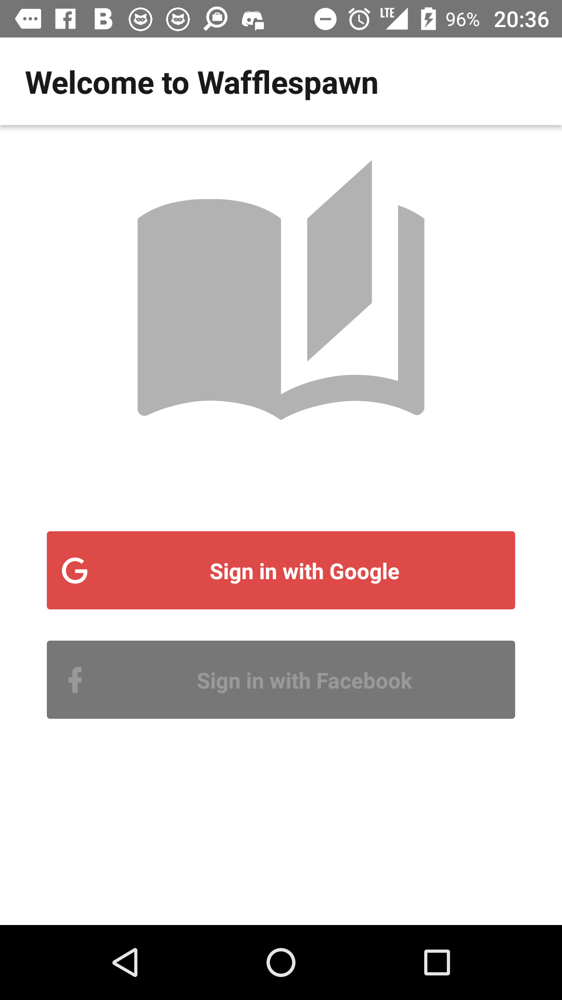
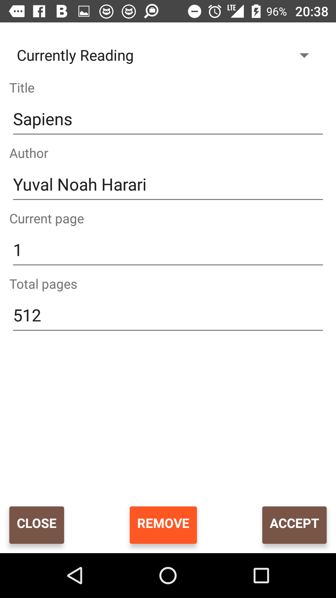

#wafflespawn - Make books great(er) again

### Sneak peek of current state

|     |     |     |
|:---:|:---:|:---:|
||||
||||
||||

### How to run

1. `git clone https://github.com/eHammarstrom/wafflespawn`
2. `cd wafflespawn && yarn install` note: `npm install` may not reproduce environment currently
3. `react-native start` or `yarn start`
    1. Head to `http://localhost:8081/debugger-ui`.
4. `react-native run-android` or `react-native run-ios`
    1. Enable `Remote JS debugging` in debug app to utilize the browser for debugging (step 3.1).

### App structure
...

### Configuration

#### android/app/google-services.json
...

#### ios/GoogleService-Info.plist
... note: needs to be updated

#### android/app/debug.keystore
Contains debug signature assigned to firebase during development

accessed via: `keytool -exportcert -list -v -alias androiddebugkey -keystore debug.keystore`

password: `android`

#### app/index.js
Configures and initializes firebase web api, works fine in react-native. (`react-native-firebase` does exist)

Configures redux store with redux-devtools middleware. See `http://remotedev.io/local/` and `remote-redux-devtools` on github.

#### app/config.js
Contains client ids for google authentication, used when retrieving idToken and accessToken for firebase login.

Will contain config for facebook authentication.
